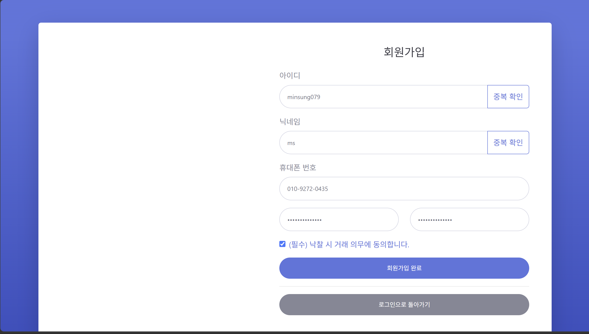
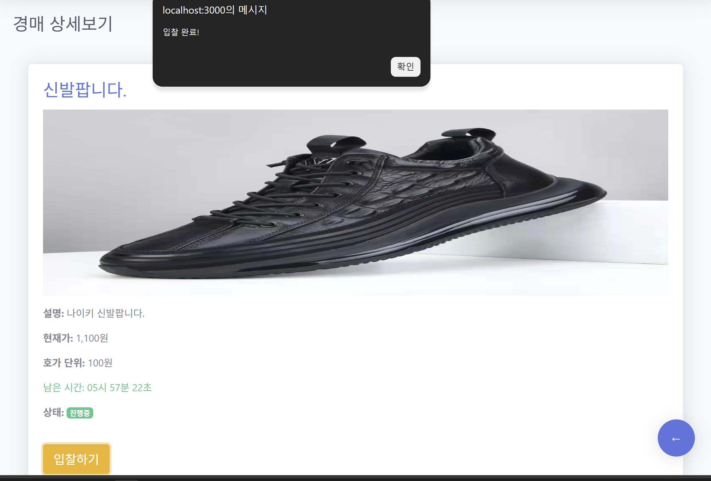
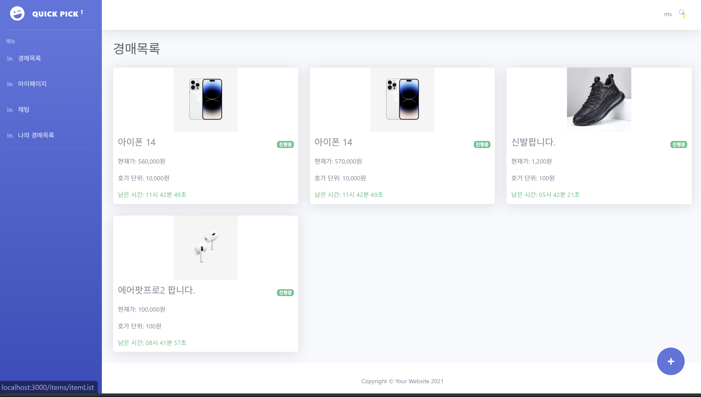

# 🔨 Protected Auction

> **실시간 경매와 채팅 기능을 제공하는 웹 기반 경매 서비스**

---

## 📌 프로젝트 소개

**Protected Auction**은 사용자가 물품을 등록하고 실시간으로 입찰할 수 있는 웹 기반 경매 플랫폼입니다.

경매가 종료되면 낙찰자와 판매자 간의 **채팅방이 자동으로 생성**되어 거래를 이어갈 수 있으며, **Socket.io**를 활용하여 실시간 입찰 및 채팅 기능을 제공합니다.

---

## 🛠️ 기술 스택

| 구분              | 기술                     |
| --------------- | ---------------------- |
| Runtime         | Node.js                |
| Framework       | Express.js             |
| Database        | PostgreSQL (Supabase)  |
| Real-time       | Socket.io              |
| Template Engine | EJS                    |
| Session         | express-session        |
| File Upload     | Multer                 |
| Date Library    | dayjs                  |
| Environment     | dotenv                 |
| UI              | Bootstrap (SB Admin 2) |

---

## 📁 프로젝트 구조

```text
Protected-Auction/
├── app.js                     # 서버 진입점 및 Socket.io 설정
├── db.js                      # PostgreSQL 연결
├── .env                       # 환경 변수
├── routes/
│   ├── login_route.js
│   ├── itemList_route.js
│   ├── itemDetail_route.js
│   ├── chat_route.js
│   ├── mypage_route.js
│   ├── myList_route.js
│   └── auctionClose_route.js
├── public/                    # 정적 파일(CSS, JS 등)
├── views/                     # EJS 템플릿
├── images/                    # README 이미지
└── uploads/                   # 상품 업로드 이미지
```

---

## 🗄️ 데이터베이스 구조

| 테이블          | 설명     |
| ------------ | ------ |
| users        | 회원 정보  |
| auction      | 경매 게시글 |
| bid          | 입찰 내역  |
| chatting     | 채팅방    |
| chattingRoom | 채팅 메시지 |

---

## ⚙️ 실행 방법

### 1. 패키지 설치

```bash
npm install
```

### 2. 환경 변수 설정

프로젝트 루트에 `.env` 파일을 생성합니다.

```env
DB_USER=your_db_user
DB_HOST=your_db_host
DB_NAME=postgres
DB_PASSWORD=your_db_password
DB_PORT=5432
```

### 3. 서버 실행

```bash
npm start
```

실행 후 아래 주소에서 확인할 수 있습니다.

```
http://localhost:3000
```

---

## ✨ 주요 기능

### 👤 회원 기능

* 회원가입 / 로그인 / 로그아웃
* 아이디 및 닉네임 중복 검사
* 마이페이지

  * 프로필 이미지 변경
  * 닉네임 변경
  * 전화번호 수정

### 🏷️ 경매 기능

* 경매 게시글 등록
* 상품 이미지 업로드
* 실시간 입찰
* 진행 중 / 종료 상태 표시
* 경매 자동 종료 처리

### 💬 채팅 기능

* 낙찰 시 판매자와 채팅방 자동 생성
* Socket.io 기반 실시간 채팅
* 입력 중(typing) 표시 기능

### 📋 마이페이지

* 내 판매 내역 조회
* 내 입찰 내역 조회

---

## 👨‍💻 개발 환경

* **개발 기간** : 2025년 1학기 웹서버프로그래밍 프로젝트
* **개발 환경** : Windows / VS Code
* **DB** : PostgreSQL (Supabase)

---

# 📸 화면 소개

### 이용약관 / 회원가입

|                   이용약관                  |                   회원가입                  |
| :-------------------------------------: | :-------------------------------------: |
|  |  |

### 경매 입찰 / 경매 목록

|                   입찰하기                  |                   경매목록                  |
| :-------------------------------------: | :-------------------------------------: |
|  |  |

### 시스템 아키텍처

<p align="center">
  
</p>

---
