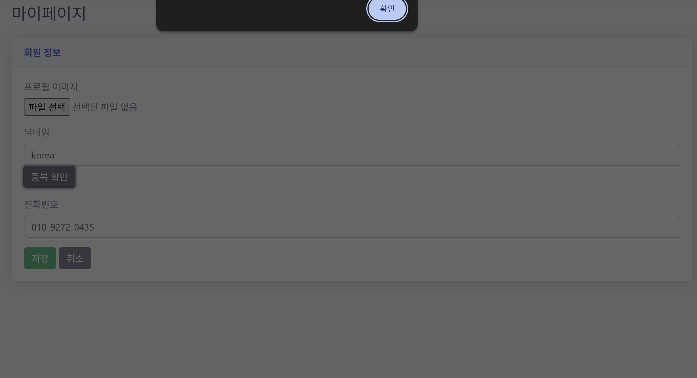
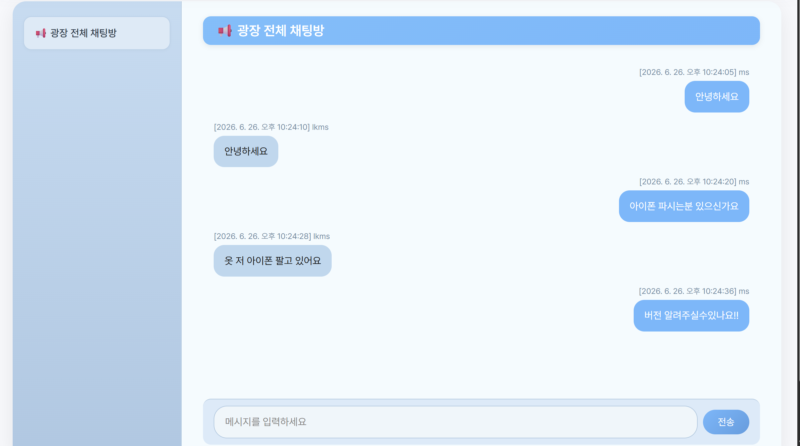

# 📸 화면 소개

## 👤 회원가입 및 마이페이지

> 서비스 시작을 위한 회원가입과 개인 정보 및 내역을 관리하는 공간입니다.

<table width="100%">
<tr>

<td align="center" width="33%">

### 이용약관

</td>

<td align="center" width="33%">

### 회원가입

</td>

<td align="center" width="33%">

### 마이페이지

</td>

</tr>
</table>

---

## 🔨 경매 및 실시간 입찰

> 등록된 경매 물품을 확인하고 실시간으로 입찰에 참여할 수 있습니다.

<table width="100%">
<tr>

<td align="center" width="50%">

### 경매 목록

</td>

<td align="center" width="50%">

### 경매 상세 및 입찰

</td>

</tr>
</table>

---

## 💬 낙찰자 실시간 채팅

> 경매 종료 후 낙찰자와 판매자 간 자동 생성되는 실시간 소통 공간입니다.

---

## ⚙️ 시스템 아키텍처

