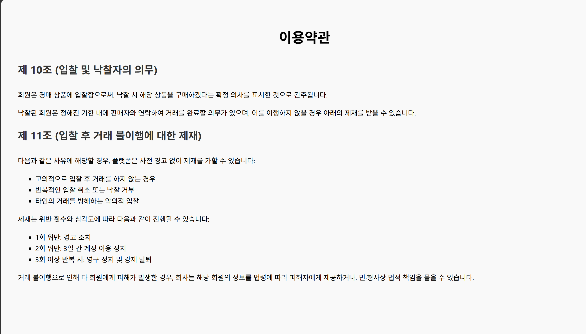
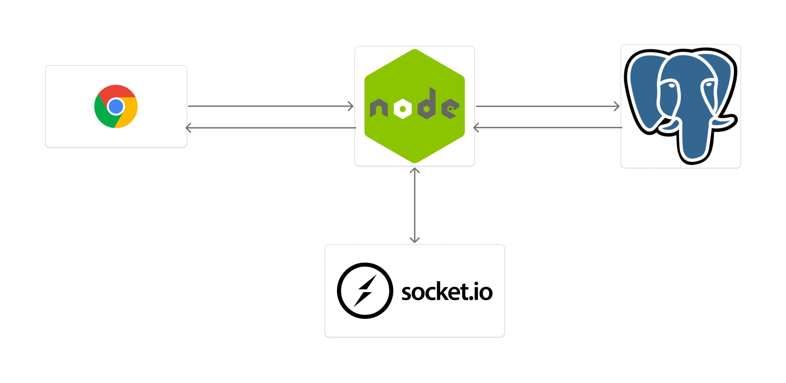

# 🔨 Protected Auction

> **실시간 경매와 채팅 기능을 제공하는 웹 기반 경매 서비스**

---

## 📌 프로젝트 소개

**Protected Auction**은 사용자가 물품을 등록하고 실시간으로 입찰할 수 있는 웹 기반 경매 플랫폼입니다.

경매 종료 후 낙찰자와 판매자 간 **채팅방이 자동 생성**되며,  
**Socket.io 기반 실시간 입찰 및 채팅 기능**을 제공합니다.

---

## 🛠️ 기술 스택

| 구분 | 기술 |
|------|------|
| Runtime | Node.js |
| Framework | Express.js |
| Database | PostgreSQL (Supabase) |
| Real-time | Socket.io |
| Template Engine | EJS |
| Session | express-session |
| File Upload | Multer |
| Date Library | dayjs |
| Environment | dotenv |
| UI | Bootstrap (SB Admin 2) |

---

## 📁 프로젝트 구조

```text
Protected-Auction/
├── app.js
├── db.js
├── .env
├── routes/
│   ├── login_route.js
│   ├── itemList_route.js
│   ├── itemDetail_route.js
│   ├── chat_route.js
│   ├── mypage_route.js
│   ├── myList_route.js
│   └── auctionClose_route.js
├── public/
├── views/
├── images/
└── uploads/
```

---

## 🗄️ 데이터베이스 구조

| 테이블 | 설명 |
|--------|------|
| users | 회원 정보 |
| auction | 경매 게시글 |
| bid | 입찰 내역 |
| chatting | 채팅방 |
| chattingRoom | 채팅 메시지 |

---

## ⚙️ 실행 방법

### 1. 패키지 설치

```bash
npm install
```

### 2. 환경 변수 설정

프로젝트 루트에 `.env` 생성

```env
DB_USER=your_db_user
DB_HOST=your_db_host
DB_NAME=postgres
DB_PASSWORD=your_db_password
DB_PORT=5432
```

### 3. 서버 실행

```bash
npm start
```

접속:

```text
http://localhost:3000
```

---

## ✨ 주요 기능

### 👤 회원 기능

- 회원가입 / 로그인 / 로그아웃
- 아이디 및 닉네임 중복 검사
- 마이페이지
  - 프로필 이미지 변경
  - 닉네임 변경
  - 전화번호 수정

---

### 🏷️ 경매 기능

- 경매 게시글 등록
- 상품 이미지 업로드
- 실시간 입찰
- 진행 상태 표시
- 경매 자동 종료

---

### 💬 채팅 기능

- 낙찰 시 채팅방 자동 생성
- Socket.io 기반 실시간 채팅
- 입력 중(typing) 표시

---

### 📋 마이페이지

- 내 판매 내역 조회
- 내 입찰 내역 조회

---

## 👨‍💻 개발 환경

| 항목 | 내용 |
|------|------|
| 개발 기간 | 2025년 1학기 웹서버프로그래밍 프로젝트 |
| 개발 환경 | Windows / VS Code |
| DB | PostgreSQL (Supabase) |

---

# 📸 화면 소개

## 이용약관 / 회원가입

| 이용약관 | 회원가입 |
|---|---|
|  |  |

---

## 경매 입찰 / 경매 목록

| 입찰하기 | 경매목록 |
|---|---|
|  |  |

---

## 시스템 아키텍처

<p align="center">
  
</p>

---

